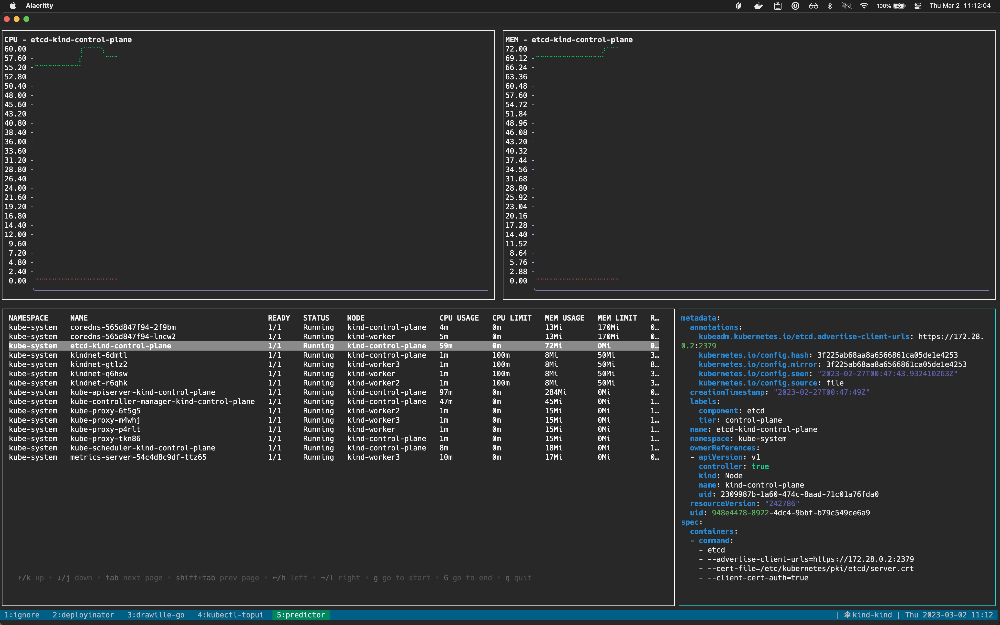

# kubectl-topui

A tui for kubectl top!

Display standard kubectl top info along with some graphs for the cpu/memory.

## Installation

```
$ kubectl krew index add chriskim06 git@github.com:chriskim06/custom-index.git
$ kubectl krew install chriskim06/topui
```

## Demo


the demo displays the braille plots a little weird because i cant figure out font stuff with the recording software. here is a screenshot


## Configuration

you can configure this plugin with a file at `~/.config/kubectl-topui/config.yml`
```
theme:
  # color of the border around the selected pane
  selected: 13

  # color for the cpu limit line in the plot
  cpuLimit: 9

  # color for the memory limit line in the plot
  memLimit: 9

  # color for the cpu usage line in the plot
  cpuUsage: 10

  # color for the memory usage line in the plot
  memUsage: 10

  # color of the x and y axis of the plots
  axis: 231

  # color of the axis labels
  labels: 231
```
